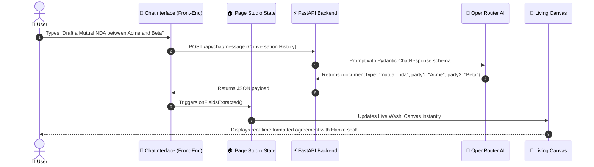

# 🌿 Beginner's Guide & Architectural Tutorial: How Prelegal Was Built

Welcome! If you are new to modern front-end web development, looking at a full-stack project with TypeScript, React, Next.js, FastAPI, Docker, and AI models can feel overwhelming. 

This tutorial is written **specifically for beginners**. It explains every piece of technology used, breaks down the architecture step-by-step, walks through real code snippets, and shows how everything connects into a tranquil, interactive legal atelier.

---

## 1. Summary of Technologies Used

Before writing code, let's understand the core tools and why each one was chosen:

```
┌─────────────────────────────────────────────────────────────────────────┐
│                           PRELEGAL ATELIER                              │
├──────────────────────────┬──────────────────────────┬───────────────────┤
│    FRONT-END CLIENT      │     BACK-END SERVER      │    PERSISTENCE    │
│  (Next.js 16 + React 19) │        (FastAPI)         │ (SQLite + Volume) │
│                          │                          │                   │
│ • TypeScript             │ • Python 3.12            │ • SQLite DB       │
│ • Tailwind CSS v4        │ • LiteLLM + OpenRouter   │ • Named Volume    │
│ • Google Fonts           │ • SQLAlchemy ORM         │ • Docker Compose  │
│ • @react-pdf/renderer    │ • JWT + Bcrypt Passwords │                   │
└──────────────────────────┴──────────────────────────┴───────────────────┘
```

| Technology | What is it? | Why do we use it? |
| :--- | :--- | :--- |
| **React 19** | A JavaScript library for building user interfaces. | Allows us to break the web page into small, reusable Lego blocks called **Components** (e.g. Chat, Document Preview, Modal). |
| **Next.js 16 (App Router)** | A production framework on top of React. | Handles routing, asset bundling, and compiles the entire front-end into blazing-fast static HTML/CSS/JS (`npm run build`). |
| **TypeScript** | JavaScript with typed variables. | Prevents bugs before they happen by making sure our data shapes (like party names and dates) are strictly defined. |
| **Tailwind CSS v4** | A utility-first styling system. | Allows us to style components quickly directly in HTML classes (e.g., `bg-[#fdfbf7] p-4 rounded-xl`). |
| **FastAPI** | A high-performance Python web API framework. | Receives requests from the browser, runs AI extraction, and serves database records. |
| **LiteLLM & OpenRouter** | Multi-model AI gateway. | Connects to free LLM models (`openai/gpt-oss-20b:free`) to convert natural conversation into structured contract fields. |
| **Docker & Docker Compose** | Software containerization. | Bundles the front-end, back-end, and database into a single container that runs identically on any computer. |

---

## 2. High-Level Walkthrough of the Architecture

### How the User Experience Flows:



1. **The User Arrives**: The browser loads the Japandi-themed studio.
2. **Conversation**: The user types naturally (e.g., *"I want an NDA between Acme Corp and Beta LLC for 2 years"*).
3. **Structured AI Extraction**: The Python backend prompts the AI to return structured data rather than raw text.
4. **State Harmony**: React's top-level state immediately reflects the extracted company names, terms, and governing state.
5. **Live Canvas & PDF**: The right side displays the rendered legal contract with the traditional Japanese Hanko seal (`印`). The user can also edit values directly or download a signed PDF with one click.

---

## 3. Detailed Code Walkthrough (With Code Samples)

Let's dissect the four most important building blocks in the codebase.

---

### Part A: The Top-Level Studio (`frontend/src/app/page.tsx`)

In React, state is data that can change over time. When state changes, React automatically re-draws the screen.

```tsx
// frontend/src/app/page.tsx (Simplified Concept)
export default function Home() {
  // 1. Declare state variables using the useState hook
  const [documentType, setDocumentType] = useState<DocumentType | null>(null);
  const [formData, setFormData] = useState<DocumentFormData>(getDefaultFormData(DocumentType.MUTUAL_NDA));
  const [isComplete, setIsComplete] = useState(false);

  // 2. Callback function when the AI extracts fields from chat
  const handleFieldsExtracted = (fields: Partial<DocumentFormData>) => {
    setFormData((prev) => {
      const { party1: newParty1, party2: newParty2, ...scalarFields } = fields;

      return {
        ...prev,
        ...scalarFields,
        // Safely merge Party 1 information without overwriting existing data
        party1: newParty1 ? mergeParty(prev.party1, newParty1) : prev.party1,
        party2: newParty2 ? mergeParty(prev.party2, newParty2) : prev.party2,
      } as DocumentFormData;
    });
  };

  return (
    <div className="grid grid-cols-12 gap-6">
      {/* Left Atelier: AI Chat Copilot */}
      <div className="col-span-5">
        <ChatInterface
          formData={formData}
          onFieldsExtracted={handleFieldsExtracted}
        />
      </div>

      {/* Right Atelier: Living Agreement Canvas */}
      <div className="col-span-7">
        <DocumentPreview
          documentType={documentType}
          formData={formData}
        />
      </div>
    </div>
  );
}
```

#### 💡 Beginner Insight:
* **What is `useState`?** Think of `useState` as a digital whiteboard. Whenever `setFormData(...)` is called, React wipes the old view and paints the new values immediately.
* **Two-Way Binding**: Because `formData` is passed to both `ChatInterface` and `DocumentPreview`, when the chat updates a field, the preview changes **instantly without reloading the page**.

---

### Part B: The Japandi Design System (`frontend/src/app/globals.css`)

Japandi blends Japanese minimalist serenity with Scandinavian warmth. Instead of default harsh blues and blacks, we defined custom CSS variables inspired by natural elements:

```css
/* frontend/src/app/globals.css */
:root {
  /* Washi Paper & Stone Surfaces */
  --washi-bg: #f5f2eb;
  --washi-surface: #fdfbf7;
  --stone-border: #e4ded3;
  
  /* Ink & Tea Charcoal */
  --sumi-ink: #1c1b18;
  --charcoal-tea: #36332e;
  
  /* Intentional Accents */
  --persimmon: #c85a38;     /* Terracotta Red */
  --moss-emerald: #31533d;  /* Zen Garden Green */
}

/* Wabi-Sabi Tactile Paper Card */
.japandi-paper {
  background: var(--washi-surface);
  border: 1px solid var(--stone-border);
  box-shadow: 0 8px 32px -8px rgba(28, 27, 24, 0.05);
  border-radius: 1rem;
}

/* Traditional Hanko Vermilion Seal */
.hanko-seal {
  display: inline-flex;
  border: 1.5px solid #c85a38;
  color: #c85a38;
  font-family: var(--font-serif), serif;
  font-weight: 700;
  border-radius: 0.375rem;
  padding: 0.15rem 0.4rem;
  font-size: 0.7rem;
  background-color: rgba(200, 90, 56, 0.04);
}
```

---

### Part C: Real-Time Field Tracking (`frontend/src/components/ExtractionProgress.tsx`)

To give users visual feedback as the AI listens, we built a progress tracker:

```tsx
// ExtractionProgress.tsx
export function ExtractionProgress({ documentType, formData }: ExtractionProgressProps) {
  // Build a list of checks
  const checks = [
    { label: 'Contract Type', done: Boolean(documentType) },
    { label: 'First Entity', done: Boolean(formData.party1?.company) },
    { label: 'Second Entity', done: Boolean(formData.party2?.company) },
    { label: 'Effective Date', done: Boolean(formData.effectiveDate) },
    { label: 'Governing Law', done: Boolean(formData.governingLaw) },
  ];

  const completedCount = checks.filter(c => c.done).length;
  const percentage = Math.round((completedCount / checks.length) * 100);

  return (
    <div className="p-4 bg-[#f9f6f0] border-b border-[#e4ded3]">
      <div className="flex justify-between text-xs mb-2">
        <span className="font-serif font-semibold text-[#1c1b18]">Contract Clarity</span>
        <span className="font-mono text-[#c85a38]">{percentage}%</span>
      </div>

      {/* Clay Progress Bar */}
      <div className="w-full bg-[#ece6dc] h-1 rounded-full overflow-hidden mb-2">
        <div 
          className="h-full bg-[#c85a38] transition-all duration-500" 
          style={{ width: `${percentage}%` }} 
        />
      </div>
    </div>
  );
}
```

---

### Part D: Lazy Loading Heavy Dependencies (`frontend/src/components/DocumentDownload.tsx`)

Generating PDFs in the browser requires `@react-pdf/renderer`, which is a large library (~1.5 MB). If loaded on page start, it slows down website speed. We solved this with **dynamic import**:

```tsx
// DocumentDownload.tsx
export function DocumentDownload({ documentType, formData }: DocumentDownloadProps) {
  const [isGenerating, setIsGenerating] = useState(false);

  const handleDownload = async () => {
    setIsGenerating(true);

    try {
      // 🌟 Dynamic Import: Only download the PDF engine when the user clicks!
      const { pdf } = await import('@react-pdf/renderer');
      
      const pdfElement = <NDAPdf formData={formData} />;
      const blob = await pdf(pdfElement).toBlob();
      
      // Create temporary download link and trigger click
      const url = URL.createObjectURL(blob);
      const link = document.createElement('a');
      link.href = url;
      link.download = `Agreement_${formData.party1.company}_${formData.party2.company}.pdf`;
      link.click();
      URL.revokeObjectURL(url);
    } finally {
      setIsGenerating(false);
    }
  };

  return (
    <button onClick={handleDownload} disabled={isGenerating}>
      {isGenerating ? "Crafting PDF..." : "捺印 Download PDF"}
    </button>
  );
}
```

---

## 4. Five Suggestions for Future Improvements (Self-Review)

Even well-crafted applications have room to grow. Here are five high-impact enhancements for the next iteration:

### 1. Multi-Turn Streaming Responses (Server-Sent Events)
* **Current State:** The chat waits for the AI to complete its entire response before displaying the message bubble.
* **Improvement:** Implement **Server-Sent Events (SSE)** or WebSockets so words stream in token-by-token in real time, making the conversational experience feel instantaneous and alive.

### 2. Multi-Party In-Browser Digital Signatures (Canvas Signature Pad)
* **Current State:** The PDF export includes signature blocks, but signatures are typed names.
* **Improvement:** Add an HTML5 `<canvas>` digital signature pad allowing parties to draw their actual handwriting signature directly inside the studio.

### 3. Redlining & Version History (Diff Comparison)
* **Current State:** Direct editing updates the active document draft.
* **Improvement:** Implement a visual "Redline Diff" mode (highlighting added terms in moss emerald and deleted clauses in persimmon) so legal teams can compare revisions across revisions.

### 4. Client-Side State Persistence via `localStorage` (Draft Auto-Recovery)
* **Current State:** If an unauthenticated user accidentally closes their browser tab, unsaved form progress in React memory is cleared.
* **Improvement:** Add a debounced `localStorage` cache hook (`useLocalStorage`) so anonymous drafts survive page reloads automatically.

### 5. Multi-Language Contract Localization (EN / JA / ES)
* **Current State:** The UI and generated contracts are primarily in English.
* **Improvement:** Support bilingual side-by-side contracts (e.g., English + Japanese), honoring the authentic Japandi atelier aesthetic for international commerce.

---

*Tutorial created for Prelegal • Happy Coding!*
